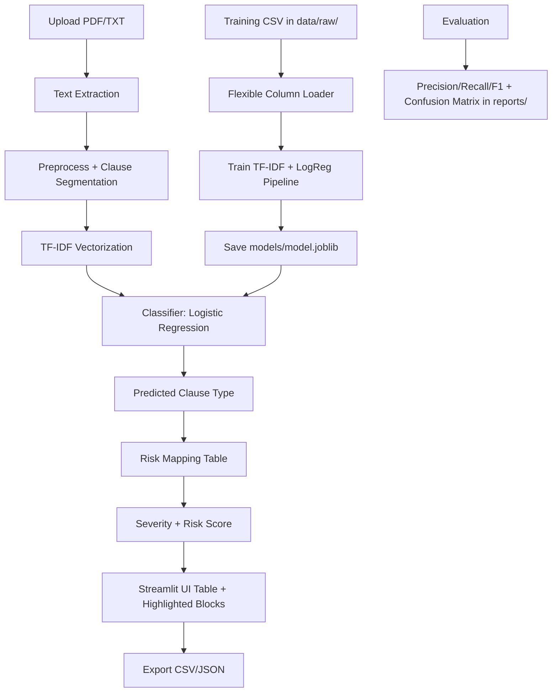

# DABB.ai: Intelligent Contract Risk Analysis (Project 7, Milestone 1)

Team: **DABB.ai**

Members:
- Birajit Saikia
- Devaansh Kathuria
- Abhey Dua
- Bhavya Jain

## 1) Overview
This Milestone 1 system uses **classical NLP + ML** (no GenAI/LLMs) to analyze contract clauses and flag potential risk.

Core flow:
1. Extract text from PDF/TXT
2. Preprocess and segment into clauses
3. Transform clauses with TF-IDF
4. Classify clause type (LogReg baseline; compare with LinearSVC and DecisionTree)
5. Map predicted type to risk severity and risk score
6. Present results in a Streamlit UI with highlighting, filters, and export

## 2) Legal Disclaimer
**This tool is informational only and is not legal advice.**
Consult a qualified legal professional before making legal decisions.

## 3) Input and Output Specification
### Input
- Contract file formats: `.pdf`, `.txt`
- Optional training CSV in `data/raw/`

### Expected training CSV schema (flexible)
The loader accepts the first matching column from each list:
- Text column candidates: `text`, `clause`, `sentence`, `content`
- Label column candidates: `label`, `category`, `clause_type`, `type`

### Output
For each clause:
- `clause_id`
- `clause_text`
- `predicted_type`
- `severity` (`Low`, `Medium`, `High`)
- `risk_score` (0-100)

UI supports:
- Risk highlighting
- Severity/type filters
- CSV/JSON export

## 4) Architecture (Milestone 1)


## 5) Repository Structure
```text
aimlproject/
├── app.py
├── data/
│   ├── raw/
│   └── demo/
├── models/
│   └── model.joblib
├── reports/
│   ├── milestone1_report/
│   └── screenshots/
├── scripts/
├── src/contract_risk/
└── tests/
```

## 6) Setup and Run
### Prerequisites
- Python 3.10+

### Install
```bash
python -m venv .venv
source .venv/bin/activate
pip install -r requirements.txt
```

### Train model
```bash
PYTHONPATH=src python -m contract_risk.cli train --csv data/raw/legal_docs_modified.csv
```

If `data/raw/legal_docs_modified.csv` is missing, fallback sample data in `data/demo/sample_training.csv` is used.

### Evaluate model
```bash
PYTHONPATH=src python -m contract_risk.cli eval --csv data/raw/legal_docs_modified.csv --reports-dir reports
```

### Run UI
```bash
streamlit run app.py
```

## 7) Deploy (Hugging Face Spaces - Streamlit)
1. Create a new Hugging Face Space with **SDK: Streamlit**.
2. Push this repository files to the Space.
3. Ensure `requirements.txt` is present at repo root.
4. Default app entrypoint should be `app.py`.
5. Space builds and serves the app publicly.

## 8) Screenshots (Placeholders)
Replace these with real screenshots before final submission.


## 9) Limitations
- Clause labels depend on training data quality and class balance.
- Rule-based risk mapping is static and domain-dependent.
- Extracted text quality from scanned/image-only PDFs may be limited.
- This milestone does not include LLM/agentic legal reasoning (reserved for Milestone 2).

## 10) Quick Commands
- `PYTHONPATH=src python -m contract_risk.cli train`
- `PYTHONPATH=src python -m contract_risk.cli eval`
- `streamlit run app.py`
- `.venv/bin/pytest -q`
