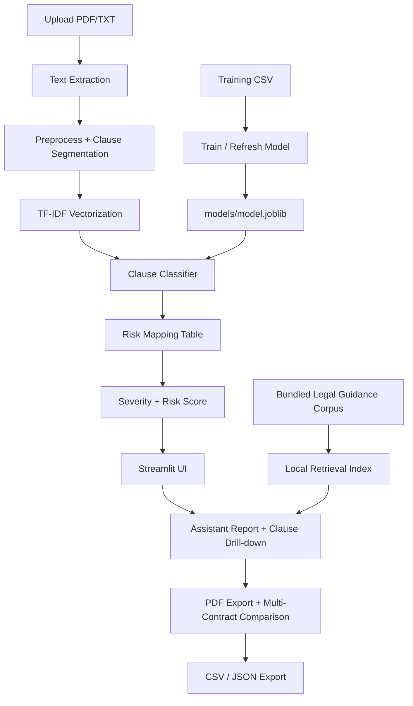

# DABB.ai: Intelligent Contract Risk Analysis

Team: **DABB.ai**

Members:
- Birajit Saikia
- Devaansh Kathuria
- Abhey Dua
- Bhavya Jain

## 1) Overview
DABB.ai is a contract risk analysis system that combines a classical clause classifier with a grounded assistant layer for structured legal-style reporting.

Milestone 2 keeps the Milestone 1 machine-learning baseline intact and extends it with:
- Clause-level assistant explanations backed by a local guidance corpus
- PDF report export for submission and demo use
- Multi-contract comparison for spotting repeated risk patterns
- Deployment-ready Streamlit entrypoints for public hosting

## 2) What the App Does
The application accepts PDF or TXT contracts and returns:
- Clause segmentation and clause IDs
- Predicted clause type
- Risk severity: `Low`, `Medium`, or `High`
- Risk score from `0` to `100`
- Highlighted high-risk clauses
- CSV and JSON exports
- Structured legal assistance report
- Optional PDF report download
- Multi-contract comparison summary

## 3) Legal Disclaimer
This tool is informational only and is not legal advice.
Always consult a qualified legal professional before making legal decisions.

## 4) Architecture

```mermaid
flowchart TD
    A[Upload PDF/TXT] --> B[Text Extraction]
    B --> C[Preprocess + Clause Segmentation]
    C --> D[TF-IDF Vectorization]
    D --> E[Clause Classifier]
    E --> F[Risk Mapping Table]
    F --> G[Severity + Risk Score]
    G --> H[Streamlit UI]
    H --> I[Assistant Report + Clause Drill-down]
    I --> J[PDF Export + Multi-Contract Comparison]
    J --> K[CSV / JSON Export]

    L[Bundled Legal Guidance Corpus] --> M[Local Retrieval Index]
    M --> I

    N[Training CSV] --> O[Train / Refresh Model]
    O --> P[models/model.joblib]
    P --> E
```

## 5) Project Layout
```text
DABB.ai/
├── app.py
├── streamlit_app.py
├── data/
├── docs/
├── models/
├── reports/
├── scripts/
├── src/contract_risk/
└── tests/
```

## 6) Local Setup
### Prerequisites
- Python 3.10+

### Install
```bash
python -m venv .venv
source .venv/bin/activate
pip install -r requirements.txt
```

### Run the app
```bash
streamlit run streamlit_app.py
```

`streamlit_app.py` is the recommended hosted entrypoint. `app.py` remains the reusable application module for local development and tests.

### Train or refresh the model
```bash
PYTHONPATH=src python -m contract_risk.cli train --csv data/raw/legal_docs_modified.csv
```

If `data/raw/legal_docs_modified.csv` is unavailable, the app falls back to `data/demo/sample_training.csv`.

### Evaluate locally
```bash
PYTHONPATH=src python -m contract_risk.cli eval --csv data/raw/legal_docs_modified.csv --reports-dir reports
```

## 7) Usage Flow
1. Upload a PDF or TXT contract, or enable the bundled demo contract.
2. Review the clause table, severity filters, and highlighted sections.
3. Generate the legal assistance report for clause explanations and mitigation guidance.
4. Export CSV, JSON, or PDF artifacts as needed.
5. Upload multiple contracts to compare repeated risk patterns.

## 8) Hosted Deployment
### Streamlit Community Cloud
1. Create a new app and point the main file at `streamlit_app.py`.
2. Keep `requirements.txt` at the repository root.
3. Use the default public deployment settings from `.streamlit/config.toml`.

### Hugging Face Spaces
1. Create a new Space with the `Streamlit` SDK.
2. Set the app entrypoint to `streamlit_app.py`.
3. Push this repository and allow the Space to install dependencies from `requirements.txt`.

### Render
1. Use the included `render.yaml` or `Procfile`.
2. Deploy the repository as a Python web service.
3. Start the app with `streamlit run streamlit_app.py`.

### Environment overrides
The app supports the following optional environment variables:
- `DABB_MODEL_PATH`
- `DABB_REPORTS_DIR`
- `DABB_TRAINING_CSV`
- `DABB_FALLBACK_TRAINING_CSV`

## 9) Testing
```bash
python3 -m compileall app.py streamlit_app.py src tests
python3 -m pytest -q
```

The repository also includes GitHub Actions CI under `.github/workflows/ci.yml`.

## 10) Limitations
- Clause labels still depend on training data quality and class balance.
- Risk scores are rule-based and should be treated as screening guidance.
- Scanned or image-only PDFs may not extract clean text.
- The assistant report is grounded in the bundled corpus, but it is still informational only.
- Multi-contract comparison surfaces repeated patterns rather than making legal judgments.

## 11) Submission Notes
- `reports/` contains the milestone report artifacts and presentation material.
- `docs/deployment.md` documents the public-host startup path and smoke checks.
- `streamlit_app.py` is the submission-ready public entrypoint.

## 12) Quick Commands
- `PYTHONPATH=src python -m contract_risk.cli train`
- `PYTHONPATH=src python -m contract_risk.cli eval`
- `streamlit run streamlit_app.py`
- `python3 -m pytest -q`
